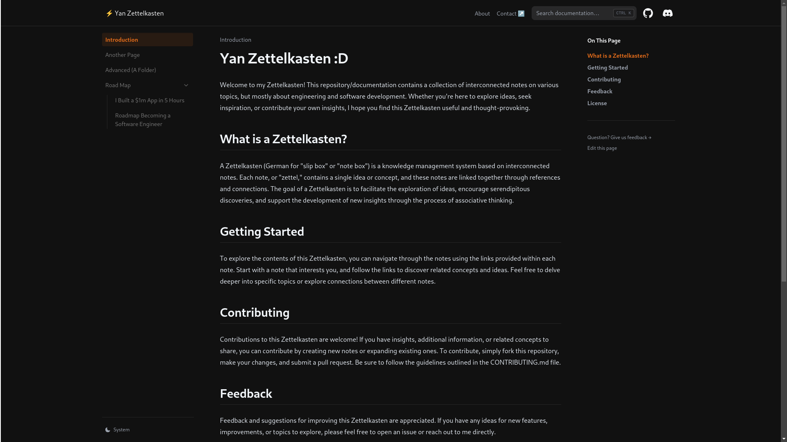

# Zettelkasten Repository

Welcome to my Zettelkasten repository! This repository serves as a digital knowledge base organized using the Zettelkasten method. Each note is a self-contained unit of knowledge, interconnected through a network of references and associations.

## What is Zettelkasten?

Zettelkasten, meaning "slip box" in English, is a method of organizing knowledge developed by sociologist Niklas Luhmann. It involves creating small notes, or "Zettels," containing ideas, insights, quotes, and references. These notes are then linked together in a non-linear manner, allowing for the emergence of new connections and insights over time.

## Contents

- **Notes**: Explore the collection of interconnected notes covering various topics such as technology, philosophy, literature, and more.
- **Tags**: Browse notes by specific topics or themes using tags.
- **Contributing**: Interested in contributing? Find out how you can contribute to the repository.

## How to Use

1. **Explore Notes**: Dive into the collection of notes to discover insights and ideas.
2. **Follow Links**: Notes are interconnected through hyperlinks. Click on any link to explore related concepts.
3. **Browse by Tags**: Use tags to find notes related to specific topics or themes.
4. **Contribute**: If you have insights, additional resources, or corrections, feel free to contribute by opening a pull request or issue.

## About

This repository is powered by [Nextra](https://nextra.vercel.app/), a Next.js-based MDX framework, making it easy to create and maintain a digital knowledge repository.

## Get Started

To get started, explore the notes in the repository or use the search functionality to find specific topics. Happy exploring!

## Contributing

Contributions to this Zettelkasten are welcome! If you have insights, additional
information, or related concepts to share, you can contribute by creating new
notes or expanding existing ones. To contribute, simply fork this repository,
make your changes, and submit a pull request. Be sure to follow the guidelines
outlined in the CONTRIBUTING.md file.

## Feedback

Feedback and suggestions for improving this Zettelkasten are appreciated. If you
have any ideas for new features, improvements, or topics to explore, please feel
free to open an issue or reach out to me directly.

## License

This Zettelkasten is licensed under the
[Creative Commons Attribution 4.0 International License](https://creativecommons.org/licenses/by/4.0/).
You are free to share and adapt the contents of this Zettelkasten for any
purpose, provided you give appropriate credit and indicate if changes were made.
