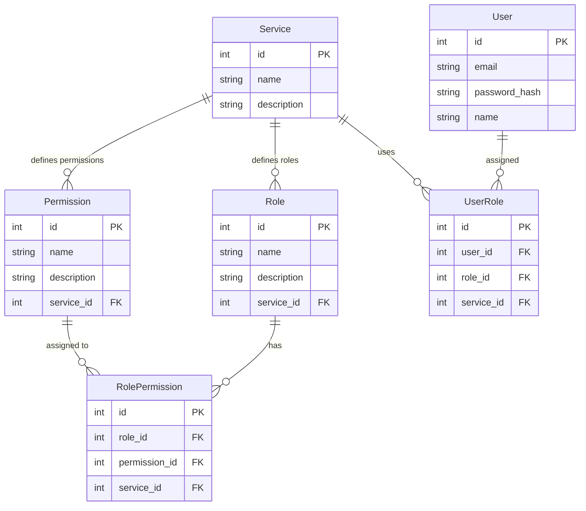

## Introduction

This documentation describes how to create a **single authentication microservice** that enables access to various services, where each service has its own roles and permissions system with variable granularity. The goal is to allow a user to have different roles and permissions in distinct services, with this information transmitted via **JWT** to manage access control using **RBAC** (Role-Based Access Control) and **ABAC** (Attribute-Based Access Control).

## Problem

The scenario involves:
- **Multiple services** (e.g., Blog, eCommerce, etc.), each with its own access control rules.
- **Shared users across services**, with distinct roles and permissions in each service.
- **Autonomy of each service** to define roles and permissions with varying levels of granularity.
- **Centralized authentication** but distributed authorization, with each service validating and controlling access independently.

## Solution

The proposed solution includes:
1. **A centralized authentication microservice** that generates JWT tokens containing a user’s roles and permissions across different services.
2. **Each service is responsible for its own access control rules**, validating the JWT and making authorization decisions based on the roles and permissions within the token.
3. **An efficiently structured relational database** to store relationships between users, services, roles, and permissions.

---

## Database Structure

### Main Entities

- **User (`User`)**: Represents the system user.
- **Service (`Service`)**: Represents each service or application a user can access.
- **Role (`Role`)**: Defines the roles associated with a specific service for a user.
- **Permission (`Permission`)**: Specifies permissions that can be assigned to each role.
- **User Role Assignment (`UserRole`)**: Links a user to a specific service and defines their role within that service.
- **Role Permission Assignment (`RolePermission`)**: Maps permissions to roles within each service.

### ER Diagram

The diagram below, created with **Mermaid**, shows the relationships between the main database entities:



---

## Model Explanation

### 1. **User (`User`)**

The `User` table contains user information such as `id`, `email`, `password_hash`, and `name`. Users can access multiple services and have different roles in each one.

### 2. **Service (`Service`)**

The `Service` table stores information about each service or application. Each service can have its own roles and permissions.

### 3. **Role (`Role`)**

The `Role` table defines roles (like `Admin`, `User`, etc.) within a service. Each service can have specific roles, independent of other services.

### 4. **Permission (`Permission`)**

The `Permission` table defines specific permissions for each service, which can vary in granularity depending on the service.

### 5. **User Role Assignment (`UserRole`)**

This table connects users to roles in a specific service. A user can have different roles in different services.

### 6. **Role Permission Assignment (`RolePermission`)**

This table maps permissions to each role within a service, allowing a `Role` to have specific permissions for its service.

---

## Authentication and Authorization Flow

### 1. **Authentication**

- The user authenticates with the authentication microservice.
- A **JWT** is generated with user claims, including their `roles` and permissions for the accessible services.
- JWT payload example:

```json
{
  "sub": "1",
  "roles": [
    {"service": "Blog", "role": "Admin"},
    {"service": "eCommerce", "role": "User"}
  ],
  "permissions": [
    {"service": "Blog", "permissions": ["write", "read"]},
    {"service": "eCommerce", "permissions": ["purchase"]}
  ]
}
```

### 2. **Authorization**

- Each service validates the JWT and extracts user role and permission information.
- Based on the user’s roles, the system checks if they have permission to perform specific actions in the service (**RBAC**).
- If the service uses ABAC, it may check additional attributes of the user or context for more granular authorization.

---

## Example of Different Granularity Between Services

### **Blog Service**

- **Roles**: `Admin`, `Editor`, `Viewer`
- **Permissions**: `write`, `read`
- The `Admin` role can have `write` and `read` permissions, while the `Viewer` role may only have `read` permission.

### **eCommerce Service**

- **Roles**: `Admin`, `Customer`, `Vendor`
- **Permissions**: `manage orders`, `purchase`, `manage products`
- The `Vendor` role may have permissions like `manage products`, while `Customer` may have the `purchase` permission.

---

## Relationship Table Organization

### `UserRole` Table

This table stores the relationship between users, roles, and services. Example:

| id  | user_id | role_id | service_id |                                 |
| --- | ------- | ------- | ---------- | ------------------------------- |
| 1   | 1       | 1       | 1          | (Alice is Admin in Blog)        |
| 2   | 1       | 5       | 2          | (Alice is Customer in eCommerce)|
| 3   | 2       | 2       | 1          | (Bob is Editor in Blog)         |
| 4   | 3       | 3       | 1          | (Carol is Viewer in Blog)       |
| 5   | 3       | 4       | 2          | (Carol is Admin in eCommerce)   |

### `RolePermission` Table

This table maps permissions to each role in each service. Example:

| id  | role_id | permission_id | service_id |                                         |
| --- | ------- | ------------- | ---------- | --------------------------------------- |
| 1   | 1       | 1             | 1          | (Admin in Blog can Write)               |
| 2   | 1       | 2             | 1          | (Admin in Blog can Read)                |
| 3   | 2       | 1             | 1          | (Editor in Blog can Write)              |
| 4   | 2       | 2             | 1          | (Editor in Blog can Read)               |
| 5   | 3       | 2             | 1          | (Viewer in Blog can Read)               |
| 6   | 4       | 3             | 2          | (Admin in eCommerce can Manage Orders)  |
| 7   | 5       | 4             | 2          | (Customer in eCommerce can Purchase)    |

---

## Conclusion

This database model and authentication/authorization flow provide:
- **Flexibility**: Allows each service to have independent roles and permissions, adapting to each one’s specific needs.
- **Scalability**: The system remains efficient and organized, even with a growing number of users and services.
- **Centralized authentication**: Facilitates user management across multiple services, ensuring a single point of control for authentication.

This system guarantees robust and flexible access control for complex scenarios involving multiple services and varying permission granularity.
