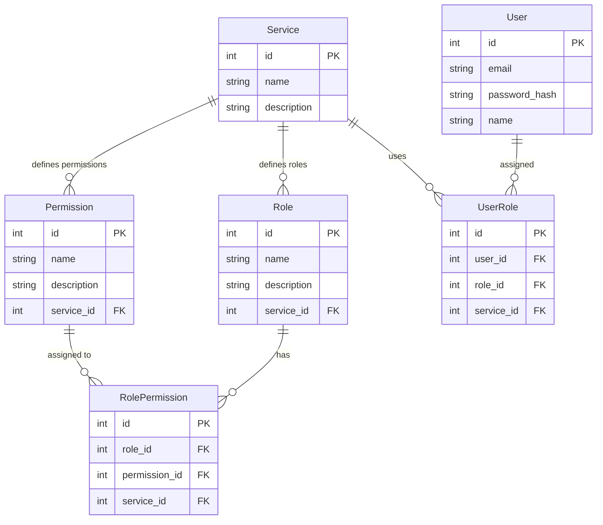

## Introdução

Esta documentação descreve como criar um **microsserviço de autenticação único** que permita o acesso a diferentes serviços, onde cada serviço possui seu próprio sistema de roles e permissões com granularidade variável. O objetivo é permitir que um usuário tenha diferentes papéis e permissões em serviços distintos e que essas informações sejam passadas via **JWT** para controle de acesso usando **RBAC** (Role-Based Access Control) e **ABAC** (Attribute-Based Access Control).

## Problema

O cenário em questão envolve:
- **Múltiplos serviços** (por exemplo, Blog, eCommerce, etc.), cada um com suas próprias regras de controle de acesso.
- **Usuários compartilhados entre serviços**, mas com diferentes papéis (roles) e permissões em cada serviço.
- **Autonomia de cada serviço** para definir papéis e permissões com diferentes níveis de granularidade.
- **Autenticação centralizada**, mas autorização distribuída, com validação e controle de acesso em cada serviço.

## Solução

A solução proposta envolve:
1. **Um microsserviço de autenticação centralizado** que gera tokens JWT contendo informações sobre os papéis e permissões de um usuário em diferentes serviços.
2. **Cada serviço é responsável por suas regras de controle de acesso**, validando o JWT e tomando decisões de autorização com base nas roles e permissões contidas no token.
3. **Um banco de dados relacional estruturado de forma eficiente** para armazenar a relação entre usuários, serviços, papéis e permissões.

---

## Estrutura de Banco de Dados

### Entidades Principais

- **Usuário (`User`)**: Representa o usuário do sistema.
- **Serviço (`Service`)**: Representa cada serviço ou aplicação que um usuário pode acessar.
- **Papel (`Role`)**: Define as roles associadas a um serviço específico para um usuário.
- **Permissão (`Permission`)**: Define as permissões específicas que podem ser atribuídas a cada role.
- **Atribuição de Role (`UserRole`)**: Associa um usuário a um serviço específico e define seu papel nesse serviço.
- **Atribuição de Permissão (`RolePermission`)**: Associa permissões a roles dentro de cada serviço.

### Diagrama ER

O diagrama abaixo, feito em **Mermaid**, mostra a relação entre as entidades principais do banco de dados:



---

## Explicação do Modelo

### 1. **Usuário (`User`)**

A tabela de `User` contém informações dos usuários, como `id`, `email`, `password_hash`, e `name`. Os usuários podem acessar múltiplos serviços e ter diferentes papéis em cada um.

### 2. **Serviço (`Service`)**

A tabela `Service` armazena informações sobre cada serviço ou aplicação. Cada serviço pode ter suas próprias roles e permissões.

### 3. **Papel (`Role`)**

A tabela `Role` define os papéis (como `Admin`, `User`, etc.) dentro de um serviço. Cada serviço pode ter papéis específicos, independentes de outros serviços.

### 4. **Permissão (`Permission`)**

A tabela `Permission` define as permissões específicas para cada serviço. Permissões podem variar em granularidade, dependendo do serviço.

### 5. **Atribuição de Role (`UserRole`)**

Essa tabela conecta usuários a papéis em um serviço específico. Um usuário pode ter diferentes papéis em diferentes serviços.

### 6. **Atribuição de Permissão (`RolePermission`)**

Esta tabela mapeia as permissões para cada role dentro de um serviço. Dessa forma, um `Role` pode ter permissões específicas para seu serviço.

---

## Fluxo de Autenticação e Autorização

### 1. **Autenticação**

- O usuário se autentica no microsserviço de autenticação.
- Um **JWT** é gerado com as claims do usuário, incluindo suas `roles` e permissões para os serviços que ele pode acessar.
- Exemplo de payload do JWT:

```json
{
  "sub": "1",
  "roles": [
    {"service": "Blog", "role": "Admin"},
    {"service": "eCommerce", "role": "User"}
  ],
  "permissions": [
    {"service": "Blog", "permissions": ["write", "read"]},
    {"service": "eCommerce", "permissions": ["purchase"]}
  ]
}
```

### 2. **Autorização**

- Cada serviço valida o JWT e extrai as informações sobre os papéis e permissões do usuário.
- Com base nas roles do usuário, o sistema verifica se ele tem permissão para realizar ações específicas no serviço (**RBAC**).
- Se o serviço usa ABAC, pode verificar atributos adicionais do usuário ou do contexto para tomar uma decisão de autorização mais granular.

---

## Exemplo de Granularidade Diferente Entre Serviços

### **Serviço Blog**

- **Roles**: `Admin`, `Editor`, `Viewer`
- **Permissões**: `write`, `read`
- O role `Admin` pode ter permissões `write`, `read`. Já o role `Viewer` pode ter apenas a permissão `read`.

### **Serviço eCommerce**

- **Roles**: `Admin`, `Customer`, `Vendor`
- **Permissões**: `manage orders`, `purchase`, `manage products`
- O role `Vendor` pode ter permissões como `manage products`, enquanto `Customer` tem a permissão `purchase`.

---

## Organização das Tabelas de Relacionamento

### Tabela `UserRole`

Esta tabela armazena a relação entre usuários, papéis e serviços. Aqui está um exemplo de como ela seria preenchida:

| id  | user_id | role_id | service_id |                                 |
| --- | ------- | ------- | ---------- | ------------------------------- |
| 1   | 1       | 1       | 1          | (Alice é Admin no Blog)         |
| 2   | 1       | 5       | 2          | (Alice é Customer no eCommerce) |
| 3   | 2       | 2       | 1          | (Bob é Editor no Blog)          |
| 4   | 3       | 3       | 1          | (Carol é Viewer no Blog)        |
| 5   | 3       | 4       | 2          | (Carol é Admin no eCommerce)    |

### Tabela `RolePermission`

Esta tabela mapeia as permissões para cada papel em cada serviço. Exemplo:

| id  | role_id | permission_id | service_id |                                         |
| --- | ------- | ------------- | ---------- | --------------------------------------- |
| 1   | 1       | 1             | 1          | (Admin no Blog pode Write)              |
| 2   | 1       | 2             | 1          | (Admin no Blog pode Read)               |
| 3   | 2       | 1             | 1          | (Editor no Blog pode Write)             |
| 4   | 2       | 2             | 1          | (Editor no Blog pode Read)              |
| 5   | 3       | 2             | 1          | (Viewer no Blog pode Read)              |
| 6   | 4       | 3             | 2          | (Admin no eCommerce pode Manage Orders) |
| 7   | 5       | 4             | 2          | (Customer no eCommerce pode Purchase)   |

---

## Conclusão

Este modelo de banco de dados e fluxo de autenticação/autorização oferece:
- **Flexibilidade**: Permite que cada serviço tenha papéis e permissões independentes, adaptando-se às necessidades específicas de cada um.
- **Escalabilidade**: Mesmo com um número crescente de usuários e serviços, o sistema permanece eficiente e organizado.
- **Centralização da autenticação**: Facilita a gestão de usuários em vários serviços ao mesmo tempo, garantindo um único ponto de controle de autenticação.

Este sistema garante controle de acesso robusto e flexível para cenários complexos com múltiplos serviços e diferentes níveis de granularidade de permissões.

---